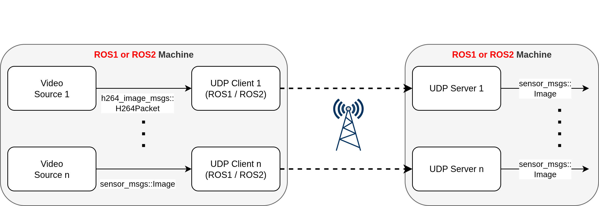

# ROS UDP Image Streamer

**:construction: Under construction. Coming Soon....**

_Maintainer:_ [Georg Beierlein](https://github.com/GeorgBe)  
TUD - Professur für Fahrzeugmechatronik

_Last update:_ 2024/09/23

## Description

This repository provides a collection of nodes to stream video data between ROS 1 and ROS 2 machines via UDP.
The `udp_client_node` subscribes for `h264_image_transport_msgs::H264Packet` or `sensors_msgs::Image` and converts them to a h264 stream using `libav` and `FFMPEG`.
The stream can be decoded on the target machine in ROS1 or ROS2 using the `image_server_node`. It listens for the stream and converts it back to ROS1/ROS2 `sensor_msgs::Image` for display in e.g. RVIZ.
Main purpose is the Teleoperation and vehicle monitoring.

